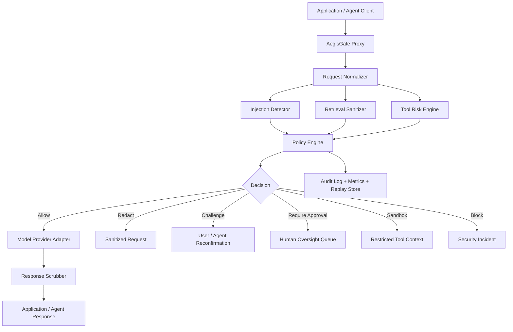

<div align="center">

# AetherSentry
### Adversarial Prompt Injection Detector & Agent Firewall

[](https://www.python.org/)
[](https://fastapi.tiangolo.com/)
[](https://nextjs.org/)
[](https://www.typescriptlang.org/)
[](https://www.langchain.com/langgraph)
[](https://www.postgresql.org/)
[](https://redis.io/)
[](https://www.docker.com/)
[](#security-by-design)
[](#roadmap)
[](./LICENSE)

**AetherSentry** is a secure, real-time agent firewall and prompt security gateway that sits in front of LLMs and agentic systems to detect prompt injection, block jailbreaks, inspect untrusted retrieved content, score tool-use risk, and enforce policy before dangerous inputs ever reach downstream models or tools.

Built for secure autonomy, explainable enforcement, and human-governed agent operations.

</div>

---

## Overview

As AI systems move from chat interfaces to autonomous agents, the attack surface changes.

The risk is no longer limited to bad model outputs. The real danger is when untrusted input manipulates an agent's reasoning, tool selection, permissions, memory, or downstream actions.

**AetherSentry** is designed to address that problem directly.

It acts as a policy-enforcing security layer between applications and model providers, helping defend against:

- direct prompt injection
- jailbreak attempts
- indirect injection hidden inside documents and retrieved content
- tool misuse coercion
- data exfiltration attempts
- privilege escalation patterns
- unsafe autonomous action chains
- prompt leakage and system instruction extraction attempts

This project is designed to demonstrate **agentic AI security engineering, policy enforcement, adversarial input detection, and production-style defensive AI infrastructure**.

---

## Why AetherSentry Matters

Most organizations are rushing to deploy AI systems before they have a control plane for secure model interaction.

That creates a dangerous gap.

If an agent can be persuaded to ignore policy, reveal protected context, misuse tools, or execute unsafe workflows, the issue is no longer just model quality. It becomes a security architecture failure.

**AegisGate** is built around one principle:

> AI systems should never directly trust the content they process.

Every prompt, retrieval chunk, tool request, and generated action should pass through a security layer that can inspect, classify, constrain, and explain.

The goal is not to make agents impossible to use.

The goal is to make them **defensible, observable, and governable**.

---

## Core Capabilities

### Prompt Injection Detection
- Detect direct jailbreaks and role override attempts
- Score coercive instructions and manipulative language
- Identify hidden instructions embedded in user input

### Indirect Injection Defense
- Inspect retrieved documents, webpages, PDFs, markdown, emails, and tool outputs
- Detect malicious instructions hidden inside untrusted content
- Prevent external content from hijacking internal agent behavior

### Tool Risk Enforcement
- Score requested tools by sensitivity, privilege, reversibility, and blast radius
- Block or sandbox high-risk action chains
- Enforce human approval for dangerous operations

### Policy-Driven Security Decisions
- Deterministic policy outcomes:
  - allow
  - redact
  - challenge
  - require-human-approval
  - sandbox
  - block
- Versioned policy promotion workflow
- Explainable reasoning for each security decision

### Response Protection
- Detect attempts to extract secrets, system prompts, internal instructions, or private context
- Scrub or block unsafe outputs before they leave the gateway
- Reduce risk of data exfiltration from downstream model responses

### Replay & Forensics
- Replay previously blocked or flagged interactions
- Inspect why the system decided to allow, redact, or block
- Support analyst review and policy tuning

---

## Architecture



---

## How It Works

AegisGate sits between your application and the model layer.

Before a request reaches the LLM or an agent runtime, AegisGate:

1. normalizes the incoming prompt and metadata
2. inspects user input and retrieved content for injection patterns
3. scores the risk of proposed tool usage
4. applies deterministic policy rules
5. allows, redacts, sandboxes, challenges, escalates, or blocks the request
6. audits the full decision chain
7. scrubs the outgoing response for leakage before returning it to the client

This gives teams a real enforcement layer instead of relying on prompt wording alone.

---

## Threats AegisGate Is Built to Address

### Direct Prompt Injection
Examples:
- attempts to override system instructions
- attempts to bypass policy
- attempts to force unsafe tool usage
- role-play jailbreak patterns

### Indirect Prompt Injection
Examples:
- malicious instructions hidden in retrieved documents
- web content telling the model to ignore previous rules
- markdown or HTML designed to alter tool behavior
- embedded prompt text inside PDFs, emails, or knowledge base entries

### Tool Misuse
Examples:
- coercing the model to call sensitive tools
- triggering unnecessary writes or exports
- attempting privilege escalation through tool selection
- chaining harmless tools into high-impact workflows

### Prompt Leakage & Data Exfiltration
Examples:
- requests to reveal hidden instructions
- attempts to exfiltrate secrets or internal memory
- extraction of private context through layered prompts
- unsafe output generation exposing protected data

---

## Security by Design

AegisGate assumes that **all external content is untrusted until proven otherwise**.

### Core Security Principles
- **Deny by default for high-risk actions**
- **No direct trust in retrieved content**
- **Deterministic policy before model freedom**
- **Human approval for sensitive operations**
- **Strict schema validation**
- **Provider-agnostic security controls**
- **Complete auditability of enforcement paths**
- **Separation of policy from model reasoning**
- **No model-driven policy promotion in production**

### Guardrail Controls
- Input validation with Pydantic
- Structured JSON output validation
- Tool allowlists
- Content provenance tagging
- Request size and rate limits
- Policy versioning and promotion flow
- Tenant-safe architecture patterns
- Tamper-aware audit logging
- Safe rendering of untrusted content in the dashboard
- Replay mode for forensic analysis

---

## Detection Strategy

AegisGate uses a layered defensive model rather than trusting a single classifier.

### Layer 1: Deterministic Rules
- explicit jailbreak phrases
- instruction override attempts
- hidden control sequences
- unsafe formatting or coercion signals

### Layer 2: Heuristics & Risk Features
- lexical risk scoring
- encoded payload detection
- prompt leakage indicators
- exfiltration patterns
- privilege escalation cues

### Layer 3: Retrieval Inspection
- scans retrieved documents and chunks for embedded instructions
- classifies untrusted context by influence potential
- isolates suspicious passages

### Layer 4: Model-Assisted Review
- uses structured, schema-constrained model analysis only after cheaper checks
- provides additional classification and rationale
- never directly overrides deterministic policy rules

### Layer 5: Policy Decision Graph
- final decision logic runs through a policy graph
- produces explainable enforcement outcomes
- logs every decision for review

---

## Policy Actions

AegisGate supports controlled enforcement modes:

- **Allow** — request is low risk and safe to forward
- **Redact** — unsafe elements are stripped or neutralized
- **Challenge** — require confirmation or clarification before execution
- **Require Human Approval** — hold the request for authorized review
- **Sandbox** — route to restricted tools or constrained context
- **Block** — prevent the request from reaching the model or tools

This allows security posture to be tuned by sensitivity, not just pass/fail logic.

---

## Tech Stack

### Frontend
- **Next.js 15**
- **TypeScript**
- **Tailwind CSS**
- **shadcn/ui**

### Backend
- **FastAPI**
- **Python 3.12**
- **LangGraph** for policy orchestration and security decision flow

### Data & Infrastructure
- **PostgreSQL**
- **Redis**
- **Docker Compose**

### AI / Security Layer
- **Gemini provider adapter**
- provider-agnostic model abstraction
- policy engine
- injection classifier pipeline
- retrieval sanitizer
- response scrubber

---

## Project Goals

- Build a real-time security gateway for LLMs and agents
- Defend against prompt injection and jailbreak attacks
- Secure agent tool use with policy-driven enforcement
- Provide explainable, auditable security decisions
- Demonstrate portfolio-grade AI security engineering
- Show production-minded thinking around safe autonomy

---

## Example Workflow

1. A client application sends a prompt to AegisGate instead of directly to the model provider
2. AegisGate normalizes the request and inspects attached retrieval content
3. The injection detector flags suspicious instruction patterns
4. The tool risk engine evaluates requested tool access and blast radius
5. The policy engine determines the correct action
6. If allowed, the request is forwarded through the provider adapter
7. The response scrubber checks for leaks or policy violations
8. The final response and full enforcement path are written to the audit log
9. Analysts can review the decision in the replay console

---

## Repository Structure

```bash
AegisGate/
├── frontend/              # Security dashboard and policy UI
├── backend/               # FastAPI proxy, detectors, policy engine, adapters
├── infra/                 # Docker, deployment, environment configs
├── docs/                  # Architecture, threat model, security notes
├── scripts/               # Benchmarks, fixtures, utilities
├── tests/                 # Unit, integration, and attack corpus tests
├── .env.example
├── docker-compose.yml
├── LICENSE
└── README.md
```

---

## Key Modules

### Request Normalizer
Responsible for:
- standardizing inbound prompt structures
- normalizing retrieval chunks
- capturing request metadata safely
- preparing inputs for downstream analysis

### Injection Detector
Responsible for:
- direct jailbreak detection
- prompt override detection
- coercion pattern scoring
- encoded or obfuscated payload analysis

### Retrieval Sanitizer
Responsible for:
- scanning untrusted documents and chunks
- detecting hidden instructions
- isolating suspicious content
- tagging provenance and risk

### Tool Risk Engine
Responsible for:
- scoring action sensitivity
- analyzing privilege level
- evaluating reversibility and blast radius
- recommending enforcement mode

### Policy Engine
Responsible for:
- deterministic security decisions
- versioned policy evaluation
- escalation and approval routing
- explainable enforcement output

### Response Scrubber
Responsible for:
- detecting prompt leakage
- blocking secret disclosure
- sanitizing unsafe output
- preventing policy-violating responses

### Replay & Forensics Engine
Responsible for:
- replaying historical interactions
- exposing decision rationale
- supporting analyst review
- improving policy tuning

---

## Outputs

AegisGate is designed to produce security artifacts such as:

- prompt risk scores
- injection classifications
- retrieval risk findings
- tool misuse risk assessments
- policy decision outcomes
- blocked or redacted interaction logs
- false positive review records
- approval queue entries
- replay-ready forensic traces
- security metrics dashboards

---

## API Surface

Planned API endpoints include:

- `POST /proxy/chat`
- `POST /proxy/agent`
- `POST /scan/content`
- `POST /scan/retrieval`
- `GET /incidents`
- `GET /policies`
- `POST /policies/draft`
- `POST /policies/promote`
- `POST /replay/run`
- `GET /metrics`

These endpoints are designed to make AegisGate usable both as a developer-facing proxy and a security control plane.

---

## Roadmap

### Phase 1
- Core repo scaffolding
- FastAPI proxy
- Next.js security dashboard
- Request normalization
- basic rule-based injection detection

### Phase 2
- Retrieval sanitizer
- tool risk engine
- structured policy engine
- audit and replay store

### Phase 3
- model-assisted classification
- response scrubbing
- policy promotion workflow
- attack corpus evaluation harness

### Phase 4
- benchmark suite
- false-positive review workflows
- multi-provider adapters
- enterprise policy hardening

---

## Evaluation Vision

AegisGate is intended to be evaluated against measurable security outcomes, including:

- jailbreak detection rate
- indirect prompt injection detection rate
- false positive rate
- latency overhead introduced by the firewall
- tool misuse interception rate
- secret leakage prevention rate
- policy correctness across test scenarios
- analyst review and replay efficiency

---

## Local Development

```bash
# Clone the repo
git clone https://github.com/yourusername/AegisGate.git
cd AegisGate

# Copy environment template
cp .env.example .env

# Start services
docker compose up --build
```

Planned local services:
- frontend UI
- backend proxy API
- postgres
- redis

---

## Documentation

Project documentation will live in `/docs`, including:

- `architecture.md`
- `threat-model.md`
- `policy-design.md`
- `security-controls.md`
- `evaluation-plan.md`
- `incident-response-notes.md`

---

## Non-Goals for v1

To keep the first version disciplined and defensible, v1 will **not** include:

- offensive exploit tooling
- bypass guidance for real systems
- autonomous policy promotion in production
- unrestricted tool execution
- browser-exposed provider secrets
- unsupported claims of perfect jailbreak prevention

AegisGate is built to reduce risk and improve control, not to promise invulnerability.

---

## Who This Project Is For

AegisGate is especially relevant for:

- AI security engineers
- security architects
- platform security teams
- red team and adversarial testing teams
- governance and AI risk leaders
- application security engineers
- recruiters evaluating agentic security engineering depth
- organizations deploying tool-using agents

---

## Vision

AegisGate reflects a broader security doctrine:

> In the age of agentic AI, the attack surface is no longer just the application.  
> It is the decision pathway between untrusted input, model reasoning, and tool execution.

AegisGate exists to secure that pathway.

---

## Status

**Current Status:** In active development

Planned milestones:
- real-time proxy
- policy engine
- retrieval sanitizer
- replay and forensic console
- benchmark harness
- provider adapter expansion

---

## License

This project is licensed under the **MIT License**.  
See [`LICENSE`](./LICENSE) for details.

---

## Connect

If you are building at the intersection of:
- AI security
- prompt injection defense
- LLM governance
- secure tool use
- agentic risk management
- policy-constrained autonomy

then AegisGate is being built for exactly that conversation.

---

<div align="center">

**AegisGate**  
Secure prompts. Governed agents. Defensible autonomy.

</div>
